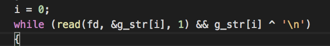
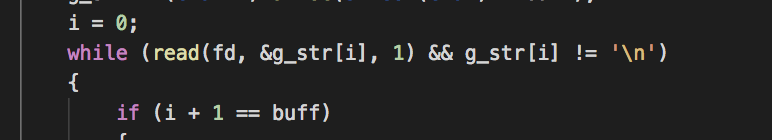

The purpose of this page is to outline notable components of existing BSQ solutions/

When times are on the order of tens of milliseconds, the comparison is lost in the noise.

| repo id | authorfile | notable component |  URL | 
|----|------------|------------------|------------|
| 0 |mvann:rariosa- | stores field as bits in unsigned long |  https://github.com/MrRobb/42_piscine/ |
| 1 |pebraun:fwuensch| -- | https://github.com/fwuensche/42-piscine-c/ |
| 2 |pcrosnie:cmutti| consistent 0.007s average | https://github.com/Tolo789/BSQ |
| 3 |	   |           |                  | https://github.com/vmarchaud/42-piscine/|
| 4 |      |           |                   | https://github.com/hopeczuba/bsq |
| 5 |      |           |                   |  https://github.com/SuperSpyTX/42-Piscine/ |
| 9 |jaleman:jguzman-|           |   0.005s                | https://github.com/jraleman/42_Piscine-C |


# Memory use
I'm using RSS/filesize as the metric for comparison.  This shows how memory consumption scales to large datasets.
| repo id | lowest RSS / filesize |
|---------|-----------------------|
|  0 |1.41 |
| 2 | 2.17 |
| 9 | 2.43 |
| 14 | 2.43 |
| 15 | 2.43 |

# Speed
| repo id | max solve time (s) (100x50000) |
|---------|-----------------------|
|  2 | 0.102 |
| 14 | 0.184 |
| 0 | 0.292 |
| 15 | 0.324 |

# Observations
## 0
### Use of global variables --> to reduce stack size?
(comments my own)
```
int g_i;
int g_l;
int g_k;

void	solve(t_bitset **map)
{
	int s;

	g_i = 0;  // only initialized here
	g_l = 0;
	g_k = 0;
	g_search_size = 1;
	while (g_i + g_search_size <= g_n)
	{
		while (g_l < g_search_size - 1)
			bs_shift(&(map[g_i + g_l++]));
		while (g_k < g_search_size - 1)
		{
			bs_shift(&(map[g_i + g_search_size - 1]));
			g_k++;
		}
		s = 1;
		while (s < g_search_size)
			bs_and(map[g_i], map[g_i + s++]);
		check_existence(existence(map[g_i], g_i), map);
	}
}
```

What?!
Is this bitwise XOR actually faster than a (more readable) inequality check??

0.255, 0.230, 0.312


0.242, 0.304, 0.325


Hmm, these results are buried in the noise.  Not statistically significant.  That is the only place this bitwise XOR is used in this project.

### 

`g_str` is malloc'd 16 bytes
`buff` is bitshifted right by one every time 16, 32, 64, ... additional bytes are read.

read() only reads one byte at a time!

```
t_bitset	*init_first_line(int fd)
{
	unsigned int i;
	unsigned int buff;

	buff = 16;
	g_str = (char *)malloc(sizeof(char) * buff);
	i = 0;
	while (read(fd, &g_str[i], 1) && g_str[i] ^ '\n')
	{
		if (i + 1 == buff)
		{
			buff <<= 1;
			g_str = str_realloc_double(g_str, buff);
		}
		i++;
	}
	g_numlongs = i / 64 + (i % 64 != 0);
	g_len = i;
	if (g_len == 0)
		return ((void *)0);
	return (init_bitset_from_str(g_str));
}
```

## 2 
entire string is read into memory.  