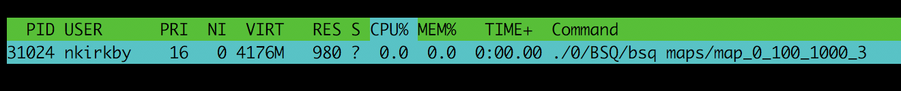
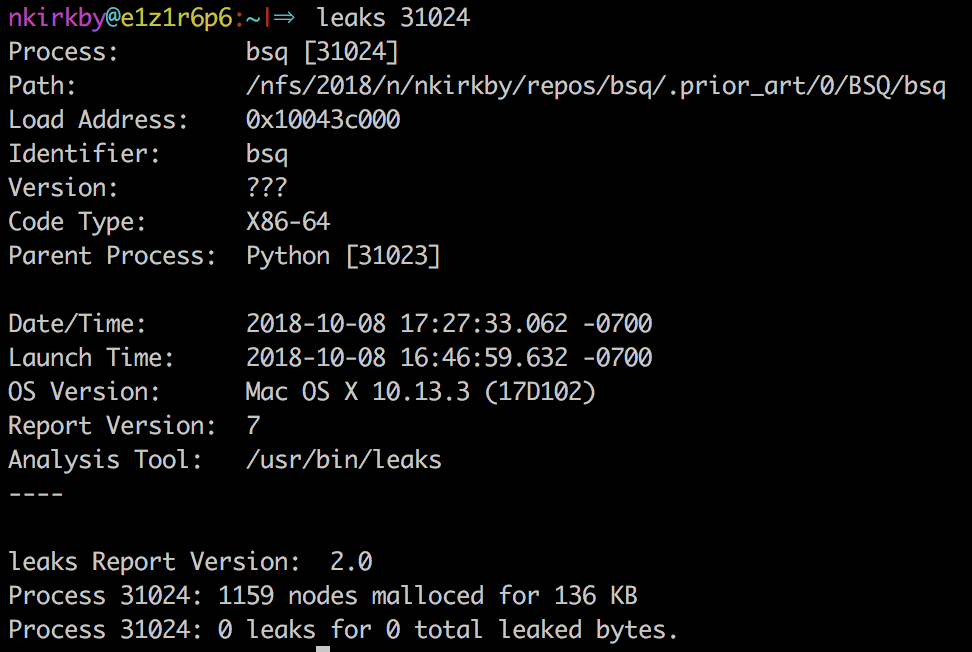
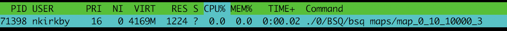

# what is memory consumption

Unless specified otherwise, the following observations were made by running the `bsq` from [here](https://github.com/MrRobb/42_piscine/) against a 100 wide x 1000 tall board.

## Terms
|abbreviation|full name| what is that |
|-|-|-|
| `VIRT`| virtual memory | the maximum amount of memory the program could access
| `RES` |resident size | how much physical memory a process is consuming
| `S/SHR`| shared memory | amount of VIRT that is shareable w/ other processes (e.g. shared libraries)
[source: Lily Feng's blog](https://lilyfeng.wordpress.com/2013/07/17/the-difference-among-virt-res-and-shr-in-top-output/), more details [in this article](https://web.archive.org/web/20120520221529/http://emilics.com/blog/article/mconsumption.html)

## Tools
- `top`, `htop` (`man ...`)
- `heap`, `leaks` (...)

OK... `htop` shows a resident size of 980KiB.

what are those units?? --> [KiB](https://en.wikipedia.org/wiki/Kibibyte) (1024-byte units)
  

and `leaks` says that 136KB have been malloc'd.



These tools must be measuring different things.
Here's a third tool, `heap`.  It shows the size of the malloced nodes.  Cool.

```
17:35 nkirkby@e1z1r6p6 /nfs/2018/n/nkirkby
% heap 31024

Zone DefaultMallocZone_0x100442000: Overall size: 18432KB; 1159 nodes malloced for 136KB (0% of capacity); largest unused: [0x7fe452801000-8196KB]

Zone DefaultMallocZone_0x100442000: 1159 nodes (138288 bytes)

    COUNT     BYTES       AVG   CLASS_NAME                                       TYPE    BINARY
    =====     =====       ===   ==========                                       ====    ======
     1146    137296     119.8   non-object
        7       336      48.0   OS_xpc_string                                    ObjC    libxpc.dylib
        2       384     192.0   OS_xpc_dictionary                                ObjC    libxpc.dylib
        1       128     128.0   OS_dispatch_queue_serial                         ObjC    libdispatch.dylib
        1        64      64.0   OS_xpc_pipe                                      ObjC    libxpc.dylib
        1        48      48.0   OS_xpc_array                                     ObjC    libxpc.dylib
        1        32      32.0   OS_xpc_uint64                                    ObjC    libxpc.dylib
```

Hmm. The number of nodes is roughly proportional to the number of rows.  What if I change the height to 10,000 and drop the width to 10?

```
Process 71398: 10159 nodes malloced for 355 KB
```
Does this implementation malloc a string for every row? 

OK, but what about `RES`, the resident memory consumption?



# HMM...

still not clear on why the output from `leaks`/`heap` differ from `top`/`htop` by almost 10x.  That's ok.  We can move forward, comparing the RES memory footprint of processes.


#### Profiling Tools

Anthology : 

http://resources.mpi-inf.mpg.de/departments/rg1/teaching/advancedc-ws08/script/lecture06.pdf

## llvm-profdata
http://cmdlinelinux.blogspot.com/2018/04/profiling-c-code-with-clang-using.html | 

`xcrun llvm-profdata`


xcode-select: error: tool 'iprofiler' requires Xcode, but active developer directory '/Library/Developer/CommandLineTools' is a command line tools instance

`instruments` may be opened via xcode


Using clang, you may instrument a program to produce profiling output:
```
clang -fprofile-instr-generate -fcoverage-mapping *.c
./a.out
xcrun llvm-profdata show -all-functions -counts -ic-targets default.profraw
```

it looks like this:
```
  ft_atoi:
    Hash: 0x06219ff5750f6b2b
    Counters: 13
    Function count: 0
    Indirect Call Site Count: 0
    Block counts: [0, 0, 0, 0, 0, 0, 0, 0, 0, 0, 0, 0]
    Indirect Target Results:
  str_realloc:
    Hash: 0x0000000000000002
    Counters: 2
    Function count: 1
    Indirect Call Site Count: 0
    Block counts: [5]
    Indirect Target Results:
```

##  pprof, gperftools

https://stackoverflow.
com/questions/37685434/problems-with-using-gperftools-on-mac-os-x
https://gist.github.com/CrazyPython/359528e67531e895e2ed945ad2e8f5c4
